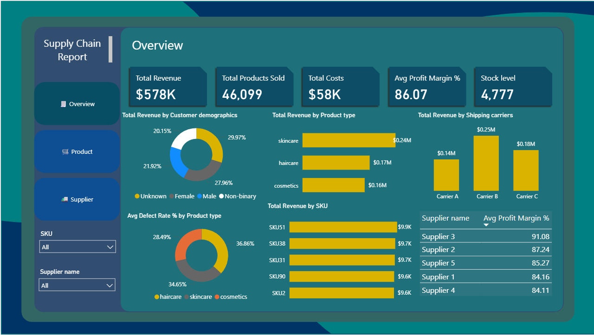

# 📊 Supply Chain Dashboard

A visually rich and interactive dashboard designed to monitor and analyze key supply chain metrics, including total revenue, product sales, costs, stock levels, defect rates, and supplier performance.



---

## 🚀 Features

- 📦 Overview of total revenue, costs, and stock levels
- 👥 Customer demographics analysis
- 🧴 Revenue by product type and SKU
- 🚚 Performance of shipping carriers
- 📉 Defect rates by product type
- 📈 Supplier-wise average profit margins
- 🔎 Dynamic filtering by SKU and supplier

---

## 🛠 Tech Stack

- **Power BI** (Visualization)
- **Excel / CSV** (Data source)
- **DAX** (Data transformations)
- **Data modeling** for relationships across products, customers, suppliers, and logistics

---

## 📌 How to Use

1. Clone this repo:
   ```bash
   git clone https://github.com/yourusername/supply-chain-dashboard.git

2.Open the .pbix file using Power BI Desktop.
3.Refresh the data source or replace with your own dataset.
4.Customize filters and visuals as per your business needs.


